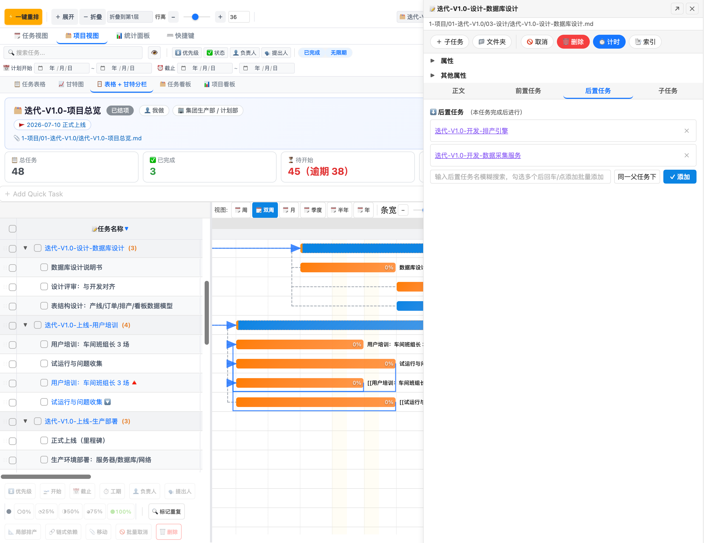
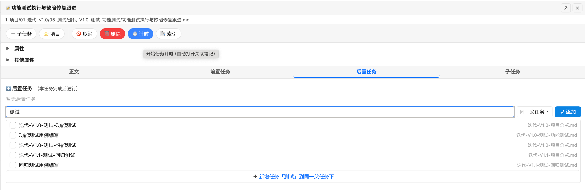
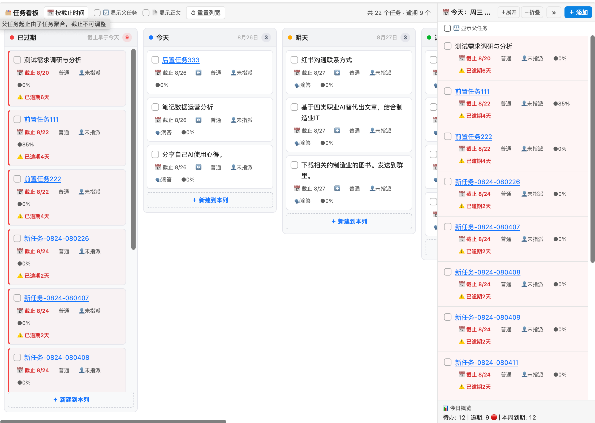
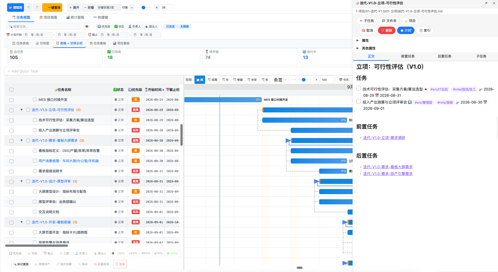
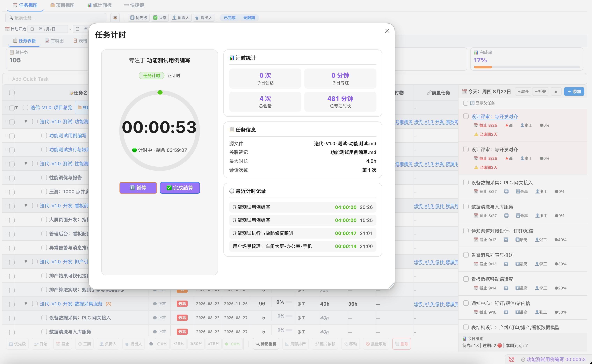

<div align="center">

# TaskNexus Free

**[中文](#-tasknexus-free-中文)** | **[English](#-tasknexus-free-english)**

> 🎯 一款强大的 Obsidian 甘特图与任务管理插件

</div>

> 📖 **[查看 Pro 版完整功能介绍 →](PRO.md)**

---

## 🇨🇳 TaskNexus Free (中文)

TaskNexus 将你的 Obsidian 知识库转变为可视化项目管理空间。在交互式甘特图上查看所有任务，一键重新排期，拖拽管理工作流。

### ✨ 功能特性

#### 📊 交互式甘特图
- **月/日双行时间轴**，5 种缩放级别（双周 → 年）
- **今日标记** — 蓝色竖线自动滚动
- **彩色任务条** 按状态区分（待办、已完成、进行中）
- **进度百分比** 显示在任务条内部（MS Project 风格）
- **父子依赖连线**（树形结构连接）



#### ✏️ 行内编辑
- **拖拽排期** — 左右移动任务条改变日期
- **拖拽调整** — 拖动右边缘调整工期
- **双击编辑** 名称、日期、优先级等
- **勾选完成** — 自动写入 ✅ 完成日期

#### 🔍 智能筛选
- **关键词搜索** 实时过滤
- **下拉筛选** — 优先级、状态、负责人、提出人
- **开关切换** — 显示/隐藏已完成任务、无限任务

#### 📁 任务层级
- **缩进子任务** 通过 Tab/4 空格缩进
- **跨文件 wiki-link 父任务** — `[[父任务名]]` 建立层级关系
- **折叠/展开** 工具栏一键操作



#### 🚀 一键排期
- **自动排期** — 移动逾期任务、分散过载、尊重依赖关系
- **局部排期** — 仅排期选中的任务



#### 📦 批量操作
- **多选** — 点击、Shift+点击范围、Ctrl+A 全选
- **批量设置** 优先级、日期、工期、进度
- **批量删除** 支持撤销

#### 📌 任务看板
- **可视化看板** — 按状态分列查看任务进度
- **拖拽切换状态** — 直观管理任务流转



#### 💾 数据安全
- **一键备份/恢复** 到 `.task-gantt/data_backups/`
- **变更记录** 跨会话保留
- **撤销/重做** — Ctrl+Z / Ctrl+Shift+Z

#### ⏱️ 任务计时
- **番茄钟式时间追踪** — 为每个任务记录专注时长
- **效率分析** — 了解时间分配



#### ⌨️ 快捷键
- `Ctrl+Shift+T` — 快速添加任务
- 完整键盘导航支持

---

### 🆚 免费版 vs Pro 版

TaskNexus 分为两个版本。**免费版**涵盖个人任务管理的核心功能，无核心功能限制。**Pro 版**解锁高级能力，适合进阶用户和团队使用。

| 功能 | 免费版 | Pro 版 |
|------|:------:|:------:|
| 甘特图（5 种缩放） | ✅ | ✅ |
| 拖拽排期 | ✅ | ✅ |
| 一键自动排期 | ✅ | ✅ |
| 局部排期 | ✅ | ✅ |
| 行内编辑 | ✅ | ✅ |
| 搜索与筛选 | ✅ | ✅ |
| 任务层级（缩进 + wiki-link） | ✅ | ✅ |
| 批量操作 | ✅ | ✅ |
| 备份/恢复/撤销 | ✅ | ✅ |
| 变更记录 | ✅ | ✅ |
| 任务看板 | ✅ | ✅ |
| 任务计时 | ✅ | ✅ |
| 快捷键 | ✅ | ✅ |
| **按人排产** | ❌ | ✅ |
| **个人容量配置** | ❌ | ✅ |
| **进行中状态 `[/]`** | ❌ | ✅ |
| **今日视图** | ❌ | ✅ |
| **统计面板** | ❌ | ✅ |
| **交付物管理** | ❌ | ✅ |
| **链式依赖排期** | ❌ | ✅ |
| **导出图片/PDF** | ❌ | ✅ |
| **AI 任务拆解** | ❌ | ✅ |
| **滴答清单同步** | ❌ | ✅ |
| **复盘总结** | ❌ | ✅ |
| **规划视图** | ❌ | ✅ |
| **项目视图** | ❌ | ✅ |
| **今日面板** | ❌ | ✅ |
| 任务数限制 | ≤100 | 无限制 |
| 文件扫描限制 | ≤200 | 无限制 |

---

### 🚀 升级 Pro 版

**TaskNexus Pro**（¥29 买断制）解锁 20+ 项高级功能：

- **👥 按人排产** — 解析 `role/指派/姓名` 标签，查看团队工作量分布
- **⚡ 个人容量** — 为每个团队成员设置不同的工作容量上限
- **🔄 进行中状态** — 用 `[/]` 区分未开始和进行中的任务
- **📅 今日视图** — "今天该做什么？"——聚焦每日任务清单
- **📊 统计面板** — 完成率、延期率、工作量分布图表
- **📎 交付物管理** — 将文件和 wiki 页面关联到任务
- **🔗 链式依赖** — FS 依赖线与链式排期
- **📤 导出** — 将任务分享为图片或 PDF
- **🤖 AI 任务拆解** — 自动将复杂任务拆解为子任务
- **🔄 滴答清单同步** — 与滴答清单/Dida365 双向同步
- **📝 复盘总结** — AI 驱动的项目复盘报告
- **🧠 规划视图** — 思维导图/树形方式规划父子任务，多布局+折叠面板
- **📋 项目视图** — 多项目总览与管理
- **📅 今日面板** — 聚焦每日任务仪表盘

👉 **获取 Pro 版**: [https://tasknexus.itwize.top/](https://tasknexus.itwize.top/)

📖 **Pro 版详细介绍**: [PRO.md](PRO.md)

---

### 📦 安装方式

#### 方式一：手动安装（推荐）

1. 从 [Releases](../../releases) 下载最新版本
2. 解压 zip 文件
3. 将三个文件复制到 Obsidian 库的插件目录：
   ```
   你的库/.obsidian/plugins/tasknexus-free/
   ├── main.js
   ├── manifest.json
   └── styles.css
   ```
4. 打开 Obsidian → 设置 → 第三方插件
5. 启用 **TaskNexus Free**

#### 方式二：BRAT 插件

1. 安装 [BRAT](https://github.com/TfTHacker/obsidian42-brat) 插件
2. 打开 BRAT 设置 → 添加 Beta 插件
3. 输入：`programerni/obsidian-tasknexus-free`
4. 启用插件

---

### 📋 系统要求

- Obsidian v1.5.7 或更高版本
- 桌面端或移动端（免费版均支持）

---

### 🛠️ 从源码构建

```bash
git clone https://github.com/programerni/obsidian-tasknexus-free.git
cd obsidian-tasknexus-free
npm install
node scripts/build-editions.mjs --edition free
```

构建产物位于 `dist/free/<版本号>/`。

---

### 📝 更新日志

详见 [CHANGELOG.md](CHANGELOG.md)。

---

### 📄 开源协议

MIT 协议 — 详见 [LICENSE](LICENSE)。

---

### 🤝 贡献

欢迎贡献代码！请提交 Pull Request。重大更改请先开 Issue 讨论。

---

### 📞 联系与支持

- **官网**: [https://tasknexus.itwize.top/](https://tasknexus.itwize.top/)
- **微信**: 激活问题请微信联系，扫描下方二维码

  

- **小红书**: [https://www.xiaohongshu.com/user/profile/55878c26c2bdeb61d6dcbb31](https://www.xiaohongshu.com/user/profile/55878c26c2bdeb61d6dcbb31)
- **GitHub Issues**: [提交 Bug 或功能建议](../../issues)

---

<p align="center">
  <b>TaskNexus Free</b> — Obsidian 可视化任务管理插件<br>
  Made with ❤️ by <a href="https://github.com/programerni">Simon Ni</a>
</p>

---
---

<div align="center">

# TaskNexus Free (English)

**[中文](#-tasknexus-free-中文)** | **[English](#-tasknexus-free-english)**

> 🎯 A powerful Gantt chart and task management plugin for [Obsidian](https://obsidian.md/)

</div>

---

TaskNexus transforms your Obsidian vault into a visual project management workspace. View all your tasks on an interactive Gantt chart, reschedule with one click, and manage your workflow with drag-and-drop ease.

### ✨ Features

#### 📊 Interactive Gantt Chart
- **Monthly/Daily dual-row timeline** with 5 zoom levels (biweekly → yearly)
- **Today marker** — blue vertical line with auto-scroll
- **Color-coded task bars** by status (todo, done, in-progress)
- **Progress percentage** displayed inside each bar (MS Project style)
- **Parent-child dependency lines** (tree-style connections)


#### ✏️ Inline Editing
- **Drag to reschedule** — move task bars left/right to change dates
- **Drag to resize** — pull the right edge to adjust duration
- **Double-click** to edit name, dates, priority, and more
- **Checkbox completion** — auto-writes ✅ completion date

#### 🔍 Smart Filtering
- **Keyword search** with real-time filtering
- **Dropdown filters** — priority, status, assignee, proposer
- **Toggle switches** — show/hide completed tasks, unlimited tasks

#### 📁 Task Hierarchy
- **Indented sub-tasks** via Tab/4-space indentation
- **Cross-file wiki-link parents** — `[[parent task]]` establishes hierarchy
- **Fold/expand** all levels from the toolbar


#### 🚀 One-Click Reschedule
- **Auto reschedule** — moves overdue tasks, distributes overloads, respects dependencies
- **Local reschedule** — only reschedule selected tasks


#### 📦 Batch Operations
- **Multi-select** — click, Shift+click range, Ctrl+A all
- **Batch set** priority, dates, duration, progress
- **Batch delete** with undo support

#### 📌 Task Board
- **Visual board** — view tasks by status columns
- **Drag to change status** — intuitive task workflow management


#### 💾 Data Safety
- **One-click backup/restore** to `.task-gantt/data_backups/`
- **Change log** preserved across sessions
- **Undo/Redo** — Ctrl+Z / Ctrl+Shift+Z

#### ⏱️ Task Timer
- **Pomodoro-style time tracking** — record focus time for each task
- **Efficiency analysis** — understand time distribution


#### ⌨️ Keyboard Shortcuts
- `Ctrl+Shift+T` — Quick add task
- Full keyboard navigation support

---

### 🆚 Free vs Pro

TaskNexus comes in two editions. The **Free** version covers personal task management with no limits on core features. **Pro** unlocks advanced capabilities for power users and teams.

| Feature | Free | Pro |
|---------|:----:|:---:|
| Gantt Chart (5 zoom levels) | ✅ | ✅ |
| Drag & Drop Rescheduling | ✅ | ✅ |
| One-Click Auto Reschedule | ✅ | ✅ |
| Local Reschedule | ✅ | ✅ |
| Inline Editing (all fields) | ✅ | ✅ |
| Search & Filter | ✅ | ✅ |
| Task Hierarchy (indent + wiki-link) | ✅ | ✅ |
| Batch Operations | ✅ | ✅ |
| Backup / Restore / Undo | ✅ | ✅ |
| Change Log | ✅ | ✅ |
| Task Board | ✅ | ✅ |
| Task Timer | ✅ | ✅ |
| Quick Add & Keyboard Shortcuts | ✅ | ✅ |
| **Assignee-based Scheduling** | ❌ | ✅ |
| **Individual Capacity Config** | ❌ | ✅ |
| **In-Progress Status `[/]`** | ❌ | ✅ |
| **Today View** | ❌ | ✅ |
| **Statistics Panel** | ❌ | ✅ |
| **Deliverable Management** | ❌ | ✅ |
| **Dependency Chain Scheduling** | ❌ | ✅ |
| **Export to Image/PDF** | ❌ | ✅ |
| **AI Task Decomposition** | ❌ | ✅ |
| **TickTick/Dida365 Sync** | ❌ | ✅ |
| **Retrospective Summary** | ❌ | ✅ |
| **Planning View** | ❌ | ✅ |
| **Project View** | ❌ | ✅ |
| **Today Panel** | ❌ | ✅ |
| Task Limit | ≤100 | ∞ |
| File Scan Limit | ≤200 | ∞ |

---

### 🚀 Upgrade to Pro

**TaskNexus Pro** (¥29 one-time purchase) unlocks 20+ advanced features:

📖 **Pro Version Details**: [PRO.md](PRO.md)

- **👥 Assignee Scheduling** — Parse `role/指派/name` tags to view team workload distribution
- **⚡ Individual Capacity** — Set different work capacity limits per team member
- **🔄 In-Progress Status** — Differentiate between not-started and in-progress tasks with `[/]`
- **📅 Today View** — "What should I do today?" — a focused daily task list
- **📊 Statistics Panel** — Completion rate, delay rate, workload distribution charts
- **📎 Deliverable Management** — Link files and wiki pages to tasks
- **🔗 Dependency Chains** — FS dependency lines with chain rescheduling
- **📤 Export** — Share tasks as images or PDFs
- **🤖 AI Task Decomposition** — Break complex tasks into subtasks automatically
- **🔄 TickTick/Dida365 Sync** — Bidirectional sync with TickTick/Dida365
- **📝 Retrospective Summary** — AI-powered project retrospectives
- **🧠 Planning View** — Mind-map and tree-style task planning with multi-layout + collapsible panels
- **📋 Project View** — Multi-project overview and management
- **📅 Today Panel** — Focused daily task dashboard

👉 **Get Pro**: [https://tasknexus.itwize.top/](https://tasknexus.itwize.top/)

---

### 📦 Installation

#### Option 1: Manual Install (Recommended)

1. Download the latest release from [Releases](../../releases)
2. Extract the zip file
3. Copy the three files into your Obsidian vault's plugin directory:
   ```
   YourVault/.obsidian/plugins/tasknexus-free/
   ├── main.js
   ├── manifest.json
   └── styles.css
   ```
4. Open Obsidian → Settings → Community Plugins
5. Enable **TaskNexus Free**

#### Option 2: BRAT Plugin

1. Install the [BRAT](https://github.com/TfTHacker/obsidian42-brat) plugin
2. Open BRAT settings → Add Beta plugin
3. Enter: `programerni/obsidian-tasknexus-free`
4. Enable the plugin

---

### 📋 Requirements

- Obsidian v1.5.7 or higher
- Desktop or Mobile (Free version supports both)

---

### 🛠️ Building from Source

```bash
git clone https://github.com/programerni/obsidian-tasknexus-free.git
cd obsidian-tasknexus-free
npm install
node scripts/build-editions.mjs --edition free
```

The built files will be in `dist/free/<version>/`.

---

### 📝 Changelog

See [CHANGELOG.md](CHANGELOG.md) for full release history.

---

### 📄 License

MIT License — see [LICENSE](LICENSE) for details.

---

### 🤝 Contributing

Contributions are welcome! Please feel free to submit a Pull Request. For major changes, please open an issue first to discuss what you would like to change.

---

### 📞 Contact & Support

- **Website**: [https://tasknexus.itwize.top/](https://tasknexus.itwize.top/)
- **WeChat**: Scan the QR code below for activation issues and support

  

- **Xiaohongshu (小红书)**: [https://www.xiaohongshu.com/user/profile/55878c26c2bdeb61d6dcbb31](https://www.xiaohongshu.com/user/profile/55878c26c2bdeb61d6dcbb31)
- **GitHub Issues**: [Report bugs or request features](../../issues)

---

<p align="center">
  <b>TaskNexus Free</b> — Visual task management for Obsidian<br>
  Made with ❤️ by <a href="https://github.com/programerni">Simon Ni</a>
</p>
