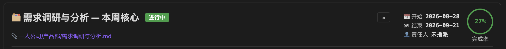
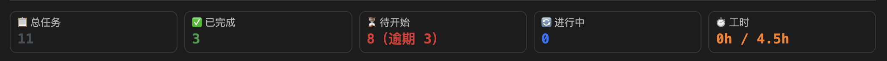
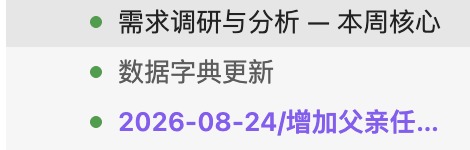

# TaskNexus Free

> 🎯 A powerful Gantt chart and task management plugin for [Obsidian](https://obsidian.md/) — Free version with core features to boost your personal productivity.

TaskNexus transforms your Obsidian vault into a visual project management workspace. View all your tasks on an interactive Gantt chart, reschedule with one click, and manage your workflow with drag-and-drop ease.

---

## ✨ Features

### 📊 Interactive Gantt Chart
- **Monthly/Daily dual-row timeline** with 5 zoom levels (biweekly → yearly)
- **Today marker** — blue vertical line with auto-scroll
- **Color-coded task bars** by status (todo, done, in-progress)
- **Progress percentage** displayed inside each bar (MS Project style)
- **Parent-child dependency lines** (tree-style connections)

### ✏️ Inline Editing
- **Drag to reschedule** — move task bars left/right to change dates
- **Drag to resize** — pull the right edge to adjust duration
- **Double-click** to edit name, dates, priority, and more
- **Checkbox completion** — auto-writes ✅ completion date

### 🔍 Smart Filtering
- **Keyword search** with real-time filtering
- **Dropdown filters** — priority, status, assignee, proposer
- **Toggle switches** — show/hide completed tasks, unlimited tasks

### 📁 Task Hierarchy
- **Indented sub-tasks** via Tab/4-space indentation
- **Cross-file wiki-link parents** — `[[parent task]]` establishes hierarchy
- **Fold/expand** all levels from the toolbar

### 🚀 One-Click Reschedule
- **Auto reschedule** — moves overdue tasks, distributes overloads, respects dependencies
- **Local reschedule** — only reschedule selected tasks

### 📦 Batch Operations
- **Multi-select** — click, Shift+click range, Ctrl+A all
- **Batch set** priority, dates, duration, progress
- **Batch delete** with undo support

### 💾 Data Safety
- **One-click backup/restore** to `.task-gantt/data_backups/`
- **Change log** preserved across sessions
- **Undo/Redo** — Ctrl+Z / Ctrl+Shift+Z

### 🎛️ Dashboard & Planning
- **Dashboard** — overview of your task landscape at a glance
- **Inspiration Board** — capture ideas before they slip away
- **Planning View** — organize tasks into actionable plans
- **Quick Add** — create tasks from the command palette

### ⌨️ Keyboard Shortcuts
- `Ctrl+Shift+T` — Quick add task
- Full keyboard navigation support

---

## 🆚 Free vs Pro

TaskNexus comes in two editions. The **Free** version covers personal task management with no limits on core features. **Pro** unlocks advanced capabilities for power users and teams.

| Feature | Free | Pro |
|---------|:----:|:---:|
| Gantt Chart (5 zoom levels) | ✅ | ✅ |
| Drag & Drop Rescheduling | ✅ | ✅ |
| One-Click Auto Reschedule | ✅ | ✅ |
| Local Reschedule | ✅ | ✅ |
| Inline Editing (all fields) | ✅ | ✅ |
| Search & Filter | ✅ | ✅ |
| Task Hierarchy (indent + wiki-link) | ✅ | ✅ |
| Batch Operations | ✅ | ✅ |
| Backup / Restore / Undo | ✅ | ✅ |
| Change Log | ✅ | ✅ |
| Dashboard & Planning View | ✅ | ✅ |
| Quick Add & Inspiration Board | ✅ | ✅ |
| Keyboard Shortcuts | ✅ | ✅ |
| **Assignee-based Scheduling** | ❌ | ✅ |
| **Individual Capacity Config** | ❌ | ✅ |
| **In-Progress Status `[/]`** | ❌ | ✅ |
| **Today View** | ❌ | ✅ |
| **Statistics Panel** | ❌ | ✅ |
| **Task Timer** | ❌ | ✅ |
| **Deliverable Management** | ❌ | ✅ |
| **Dependency Chain Scheduling** | ❌ | ✅ |
| **Export to Image/PDF** | ❌ | ✅ |
| **AI Task Decomposition** | ❌ | ✅ |
| **TickTick Sync** | ❌ | ✅ |
| **Retrospective Summary** | ❌ | ✅ |
| Task Limit | ≤100 | ∞ |
| File Scan Limit | ≤200 | ∞ |

### 🚀 Upgrade to Pro

**TaskNexus Pro** (¥29 one-time purchase) unlocks:

- **👥 Assignee Scheduling** — Parse `#role/assignee/name` tags to view team workload distribution
- **⚡ Individual Capacity** — Set different work capacity limits per team member
- **🔄 In-Progress Status** — Differentiate between not-started and in-progress tasks with `[/]`
- **📅 Today View** — "What should I do today?" — a focused daily task list
- **📊 Statistics Panel** — Completion rate, delay rate, workload distribution charts
- **⏱️ Task Timer** — Pomodoro-style time tracking for personal productivity
- **📎 Deliverable Management** — Link files and wiki pages to tasks
- **🔗 Dependency Chains** — FS dependency lines with chain rescheduling
- **📤 Export** — Share tasks as images or PDFs
- **🤖 AI Task Decomposition** — Break complex tasks into subtasks automatically
- **🔄 TickTick Sync** — Bidirectional sync with TickTick/Dida365
- **📝 Retrospective Summary** — AI-powered project retrospectives

👉 **Get Pro**: [Purchase on Gumroad](https://gumroad.com/l/tasknexus-pro) *(coming soon)*

---

## 📦 Installation

### Option 1: Manual Install (Recommended for now)

1. Download the latest release from [Releases](../../releases)
2. Extract the zip file
3. Copy the three files into your Obsidian vault's plugin directory:
   ```
   YourVault/.obsidian/plugins/tasknexus-free/
   ├── main.js
   ├── manifest.json
   └── styles.css
   ```
4. Open Obsidian → Settings → Community Plugins
5. Enable **TaskNexus Free**

### Option 2: BRAT Plugin

1. Install the [BRAT](https://github.com/TfTHacker/obsidian42-brat) plugin
2. Open BRAT settings → Add Beta plugin
3. Enter: `programerni/obsidian-tasknexus-free`
4. Enable the plugin

---

## 🖼️ Screenshots

| Gantt Chart View | Dashboard |
|:---:|:---:|
|  |  |

| Quick Add | Planning View |
|:---:|:---:|
|  |  |

---

## 📋 Requirements

- Obsidian v1.5.7 or higher
- Desktop or Mobile (Free version supports both)

---

## 🛠️ Building from Source

```bash
git clone https://github.com/programerni/obsidian-tasknexus-free.git
cd obsidian-tasknexus-free
npm install
node esbuild.config.mjs production
```

The built `main.js` will be in the project root.

---

## 📝 Changelog

See [CHANGELOG.md](CHANGELOG.md) for full release history.

---

## 📄 License

MIT License — see [LICENSE](LICENSE) for details.

---

## 🤝 Contributing

Contributions are welcome! Please feel free to submit a Pull Request. For major changes, please open an issue first to discuss what you would like to change.

---

## ⭐ Support

If you find TaskNexus helpful, please give it a ⭐ on GitHub! It helps others discover the plugin.

For bug reports and feature requests, please use [GitHub Issues](../../issues).

---

<p align="center">
  <b>TaskNexus Free</b> — Visual task management for Obsidian<br>
  Made with ❤️ by <a href="https://github.com/programerni">Simon Ni</a>
</p>
